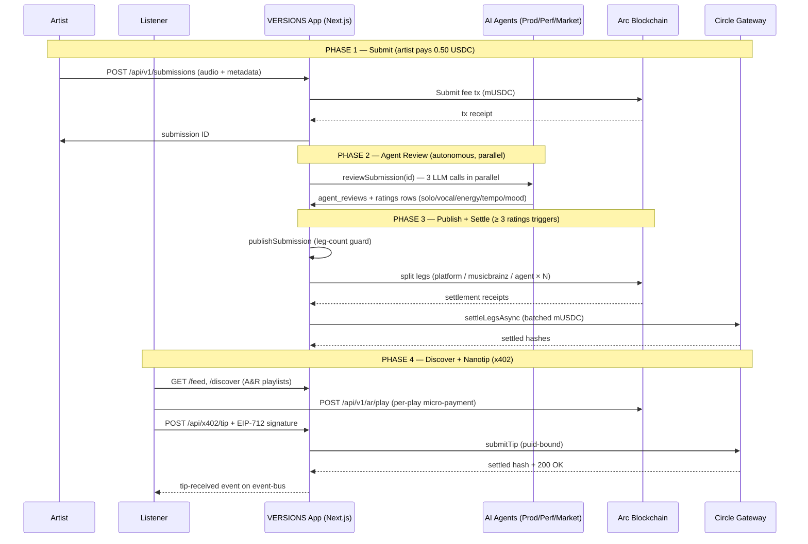
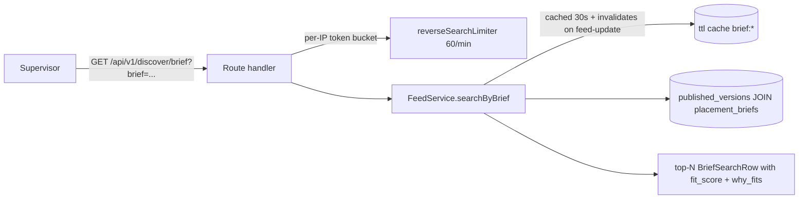

# VERSIONS · Next.js (production architecture)

This is the production-grade rebuild of the VERSIONS Lepton Submission
Marketplace, ported from the vanilla Node.js + SQLite + browser-ESM
architecture at `../versions` to **Next.js 16.2** with **PostgreSQL**
(Neon serverless), **NextAuth v5** (wallet credentials), **Wagmi v2** +
**RainbowKit**, **Drizzle ORM**, and the **Vercel AI SDK**.

## Stack

- **Next.js** 16.2.9 (App Router, Turbopack, React 19.2)
- **TypeScript** 5, strict
- **Tailwind CSS** v4 with the VERSIONS design system (cream / ink / rust, Fraunces serif, JetBrains Mono)
- **Drizzle ORM** + `@neondatabase/serverless`
- **NextAuth v5** beta with `Credentials` provider for wallet signatures
- **Wagmi v2** + **RainbowKit** for wallet UX
- **Vercel AI SDK** (`ai`, `@ai-sdk/openai`) for the curator agents
- **Zod** for validation
- **Framer Motion** for kinetic transitions (parallax, scroll reveals)

## The VERSIONS demo loop

The full VERSIONS autonomous curation loop, end to end, in four phases.
Stripe-style x402 nanopayments and Circle Gateway batched settlement
drop into a familiar submit → review → publish → discover flow.



Every state transition is publish-gated; the leg-count formula is
single-sourced from `expectedLegCountFor(curatorCount)`; the sweeper
recovers any legs stuck `pending` beyond 30 s; and every x402 tip is
replay-protected by a unique `puid` index.

## Build commands

```bash
npm install
npm run dev      # next dev .
npm run build    # next build . --experimental-build-mode compile
npm start        # next start .
npm test         # vitest (309 tests)
npm run db:push  # drizzle-kit push
npm run db:studio
pnpm demo        # self-driving submit → pay → review → publish → tip loop (assumes `pnpm run dev` is up + `pnpm db:push` has been run)
```

### Why `--experimental-build-mode compile`

Next.js 16.2.9 has a known Turbopack regression (workStore invariant) when
prerendering internal `/_global-error` and `/_not-found` routes during a
default `next build`. The `compile` build mode produces the same artifacts
but marks every route as **ƒ Dynamic — server-rendered on demand**, which is
the correct mode for an authenticated marketplace anyway.

## Environment

Copy `.env.example` to `.env` and fill in:

```
DATABASE_URL=postgresql://...       # Neon pooled connection string
NEXTAUTH_SECRET=                    # openssl rand -base64 32
NEXTAUTH_URL=http://localhost:3000
NEXT_PUBLIC_WC_PROJECT_ID=          # WalletConnect Cloud project id (optional)
ARC_RPC_URL=https://...             # Arc testnet/mainnet RPC
ARC_PAYMENT_RECIPIENT=0x...
OPENAI_API_KEY=sk-...               # Curator agents
PINATA_API_KEY=...                  # IPFS audio uploads
```

## Routes

| Route | Purpose |
| --- | --- |
| `/` | Brand-forward landing with 4-section nav |
| `/submit` | Submit a version (audio upload + metadata + 0.50 USDC fee) |
| `/agents` | Agent monitor — watch AI agents review the queue in real time |
| `/feed` | Published versions with mood/energy/tempo filters |
| `/discover` | A&R agent playlists with per-play micro-payments |
| `/api/health` | Service health probe |
| `/api/events` | SSE stream for real-time feed + queue updates |
| `/api/v1/feed` | List published submissions (filtered) |
| `/api/v1/submissions` | Create / list submissions |
| `/api/v1/submissions/queue` | Curation queue |
| `/api/v1/submissions/[id]/verify-payment` | Verify on-chain payment |
| `/api/v1/submissions/[id]/claim` | Claim a submission for curation |
| `/api/v1/submissions/[id]/rate` | Submit a rating |
| `/api/v1/submissions/[id]/reviews` | Agent reviews for a submission |
| `/api/v1/submissions/[id]/brief` | Placement brief |
| `/api/v1/versions/[id]` | Single published version |
| `/api/v1/ar/playlists` | A&R playlists |
| `/api/v1/ar/playlists/generate` | Generate new playlists via LLM |
| `/api/v1/ar/play` | Record a play (micro-payment) |
| `/api/v1/artists/[wallet]/versions` | Artist dashboard — versions |
| `/api/v1/artists/[wallet]/earnings` | Artist dashboard — earnings |
| `/api/v1/discover/brief` | Supervisor inverse-search — paste a brief, get ranked matches |
| `/api/v1/arc/info` | Arc chain info (mock or live) |
| `/api/auth/[...nextauth]` | NextAuth handler (wallet credentials) |

## Project layout

```
src/
├── app/                      # App Router
│   ├── api/                  # Route handlers
│   │   ├── v1/               # Versioned API surface
│   │   ├── events/           # SSE endpoint
│   │   └── x402/             # nanopayment tip route (x402 + Circle Gateway)
│   ├── agents/               # Agent monitor dashboard
│   ├── discover/             # A&R playlists page
│   ├── feed/                 # Published feed page
│   ├── submit/               # Submission form page
│   ├── globals.css           # Tailwind v4 design system
│   ├── layout.tsx            # Root layout
│   ├── not-found.tsx         # 404
│   ├── page.tsx              # Landing
│   └── providers.tsx         # Session + Wagmi + RainbowKit + Query
├── components/
│   ├── audio/                # AudioPlayer
│   ├── cover/                # Cover SVG rendering
│   ├── curation/             # AgentMonitor, TasteGraph, etc.
│   ├── discovery/            # DiscoverView (A&R playlists)
│   ├── feed/                 # FeedView
│   ├── submit/               # SubmitForm
│   ├── ui/                   # Shared UI (Toast, etc.)
│   ├── wallet/               # Wallet connection components
│   └── SiteHeader.tsx        # Shared header + tab nav
├── services/
│   ├── submissions.ts        # Create, verify payment, list queue
│   ├── curation.ts           # Claim, rate, publish
│   ├── feed.ts               # List published versions
│   ├── settlement.ts         # Fee split + settlement legs
│   ├── agents.ts             # AI agent auto-review
│   ├── ar.ts                 # A&R playlist generation
│   └── taste-graph.ts        # Rating aggregation
├── adapters/
│   ├── arc.ts                # Arc blockchain adapter
│   ├── gateway.ts            # Circle Gateway adapter (x402 nanopayments)
│   └── llm.ts                # LLM adapter (agent reviews)
├── lib/
│   ├── api-client.ts         # Typed fetch client
│   ├── cache.ts              # In-process TTL cache w/ event-bus invalidation
│   ├── config.ts             # Env helpers
│   ├── db.ts                 # Neon + Drizzle client
│   ├── event-bus.ts          # In-process pub/sub (SSE backing)
│   ├── ipfs.ts               # Pinata IPFS upload
│   ├── logger.ts             # Structured logging
│   ├── multipart.ts          # Multipart form parsing
│   ├── rate-limit.ts         # Per-IP token-bucket rate limiter
│   ├── schema.ts             # Drizzle schema (12 tables)
│   ├── transaction.ts        # Logical transaction wrapper (compensating rollback)
│   ├── types.ts              # Shared TS types
│   ├── utils.ts              # escapeHtml, cn, etc.
│   ├── validation.ts         # Zod rating validation
│   ├── wagmi.ts              # Wagmi config
│   └── x402.ts               # EIP-712 challenge + verify for nanopayment tips
```

## Migration notes

The migration from the vanilla Node.js proxy to Next.js is complete.
The old `versions-next/` scaffolding directory has been removed.
For the pre-migration project history, see commits before `7b05e333`.
### Remaining work

- [ ] WalletConnect project ID (`NEXT_PUBLIC_WC_PROJECT_ID`) — required for RainbowKit wallet connections
- [ ] Production deployment config (Vercel, Railway, or Docker)

## Publish pipeline hardening

The settlement pipeline has been hardened against double-publish races and
partial-publish state. Key invariants:

- **`uq_legs_submission_wallet_role`** — Postgres unique index on
  `settlement_legs(submission_id, recipient_wallet, recipient_role)`. The
  composite key is required because the same wallet can legitimately appear
  in multiple roles (e.g. the artist is both the `musicbrainz` recipient
  and the `platform` fallback). DDL is mirrored in `tests/helpers/db.ts`.
- **`PublishLegIncompleteError`** — named error class thrown by
  `publishSubmission` when the leg-count guard detects a partial insert.
  Carries `submissionId`, `expected`, `actual`, and `actualLegIds` so
  upstream callers (`curation.ts submitRating`, `agents.ts
  reviewSubmission`) can detect it via `instanceof` and return a
  structured `{ ok: false, error, code: 'publish_legs_incomplete' }`
  response.
- **`expectedLegCountFor(curatorCount)`** — single source of truth for
  the leg-count formula (`curatorCount + 2 = 1 platform + 1
  musicbrainz`). Used by the under-count guard, the over-count warning
  log, and `settlement.splitFee`'s minimum-count check so the "+2"
  invariant can't drift between call sites.
- **`transactional()` wrapper** — logical transaction for Neon HTTP.
  Services that make multi-step DB writes (rating → count → publish →
  leg) wrap their work in `transactional()` so a failure rolls back
  partial state via compensating actions instead of leaving orphan rows.
- **Over-count soft warning** — when orphan legs with `(wallet, role)`
  combos the build doesn't generate are present, the publish still
  succeeds but `log.warn` emits `extraLegIds` / `extraLegKeys` (via set
  difference against the expected keys) so stale rows are traceable
  for cleanup.

## Nanopayments (x402 + Circle Gateway)

The artist dashboard exposes a **Tip** button that lets a listener send a
sub-cent USDC nanopayment to any artist on Arc. The flow uses the
[x402 protocol](https://docs.x402.org) with **Circle Gateway** as the
batched settlement layer:

1. **Client → Server (no payment proof):** `POST /api/x402/tip` with
   `{artistWallet, amountUsdc}`. The route returns **HTTP 402** with a
   `PAYMENT-REQUIRED` header (Base64 JSON) containing the EIP-712
   challenge — the offer the client must sign.
2. **Client signs the offer** with `useSignTypedData` from wagmi. The
   challenge carries the actual Arc `chainId` (not hardcoded to 1) so
   the wallet signs on its current chain.
3. **Client → Server (with payment proof):** Retry the same `POST` with
   a `PAYMENT-SIGNATURE` header (Base64 JSON `{scheme, signature,
   offer}`). The server:
   - decodes and re-validates the challenge (same `payTo`, `amount`,
     `puid`, `validUntil`)
   - recovers the tipper wallet from the EIP-712 signature
   - persists the proof to `x402_proofs` (replay-protected by a
     unique index on `puid`)
   - submits the tip to **Circle Gateway** (`POST {GATEWAY_API_URL}/v1/tips`)
   - emits a `tip-received` event on the bus for real-time dashboards

### Amounts and the lepton primitive

USDC has 6 decimals. The smallest unit — **1 lepton** = `$0.000001` =
`1` micro-USDC — is the floor of the Gateway. Presets on the TipButton:

- **1 lepton** (`$0.000001`) — literally the smallest settleable unit
- **1¢** (`$0.01`) = 10,000 leptons
- **5¢** (`$0.05`) = 50,000 leptons
- **25¢** (`$0.25`) = 250,000 leptons
- **Custom** — any decimal string, per-tip cap is `$1.00`

### Environment variables

```
GATEWAY_API_URL=https://gateway.circle.com   # optional; mock mode if absent
GATEWAY_API_KEY=...                         # optional; Bearer token
GATEWAY_BATCH_INTERVAL_MS=500               # hint for the batcher
```

The Gateway adapter is **mock-first** (same pattern as the arc
adapter): with no `GATEWAY_API_URL` set, `submitTip` returns a
deterministic hash and tags the response with `mock: true` so the
demo and tests are reproducible.

### Files

- `src/lib/x402.ts` — EIP-712 domain/types, `verifyProof`, `offerMatches`,
  `parseAmountToMicroUsdc`, `formatMicroUsdc`, base64 header codecs
- `src/adapters/gateway.ts` — mock-first Gateway client (`submitTip`,
  `getInfo`, `getTipStatus`)
- `src/app/api/x402/tip/route.ts` — the two-shot route
- `src/components/wallet/TipButton.tsx` — the client UI
- `src/lib/format.ts` — `fmtLeptons` (sub-cent formatter)
- `src/lib/event-bus.ts` — `'tip-received'` event
- `src/lib/schema.ts` — `x402_proofs` table
- `tests/unit/x402.test.ts` — verifyProof with a real viem test wallet,
  Gateway mock, route 402/200/401/409

## Supervisor inverse-search

The market agent now emits a sync-grounded `placement_brief` per
published version: `scene_tags` (≤8 short noun phrases), `instruments`
(≤16 controlled vocab like `guitar_led`), `emotional_arcs` (≤5 free-text),
`sync_comparables` (`[ {name, why} ]`), and `audience_summary`. A
supervisor in the field pastes a plain-English brief and the platform
returns ranked matches with `why_fits` citations.



### Scoring (v1, structured-tag overlap)

| hit | weight |
| --- | --- |
| scene_tag (`tokens.some(t => tag.includes(t))`) | +3 |
| instrument (`tokens.some(t => t===inst \|\| inst.includes(t))`) | +2 |
| emotional_arc (substring) | +1 |
| audience_summary substring | +1 |
| popularity tiebreaker | 0.1 × rating_count |
| recency tiebreaker | 0.05 × max(0, 30 − daysSince) |

Tiebreaker nudges are bounded so popularity + recency never override a
real overweight signal.

### Route invariants

- `brief` length **3-500** chars → 400 `INVALID_BRIEF` otherwise
- per-IP rate-limit **60 req / min** → 429 `RATE_LIMITED` otherwise
- 200 OK envelope on hit: `{ success: true, data: { total, limit, offset, rows[] } }`
- rows are sorted by `fit_score` DESC, then by `published_at` DESC
- result rows are cached 30 s under `brief:*`; `feed-update` event wipes every key so a publish invalidates the index surface non-stale

### Wire shape — `BriefSearchRow` (snake_case)

- `submission_id, title, artist_name, version_type, audio_path, cover_svg,
  avg_solo_intensity, avg_vocal_quality, energy_consensus, tempo_consensus,
  rating_count, aggregated_mood_tags, published_at (ISO)`
- `fit_score` (rounded to 2dp); `why_fits` (≤3 plain-language citations, e.g. `scene: car chase`,
  `instrument: guitar_led`, `summary match`)
- `brief` block: `{ scene_tags, instruments, emotional_arcs, sync_comparables: [{name, why}],
  audience_summary }`

### Files

- `src/app/api/v1/discover/brief/route.ts` — `GET` handler
- `src/services/feed.ts` — `searchByBrief` + tokenize + scoreAgainstBrief + explainFit + briefCacheKey
- `src/lib/types.ts` — `BriefSearchRow` + `BriefSearchResponse` + canonical `MoodTagsEnvelope`
- `src/lib/api-client.ts` — `searchByBrief` wire helper (CSV filters, snake_case params)
- `src/components/discovery/DiscoverView.tsx` — `MatchSearch` panel (textarea + char-counter + result cards)
- `tests/unit/feed.test.ts` — service-level coverage (match / stop-words short-circuit / cache invalidation)
- `tests/unit/discover-brief.test.ts` — route-level coverage (400 bounds, 200 wire lock, 429 burst)
- `src/lib/event-bus.ts` — `feed-update` event invalidates both `feed:*` and `brief:*` cache keys

## Roadmap (Week 3+)

The supervisor inverse-search is **structured-tag-only** today; the next
two PRs bring it to parity with what a real A&R supervisor wants in a
field-trial, plus a few defensive carries that came out of the Week-2
review.

### Up next

- **Audio embeddings (CLAP / pgvector)** — replace structured-tag overlap with
  semantic audio similarity on a `pgvector` index keyed by the CLAP embedding.
  Catalog backfill (`embedAllPublished()`) runs as a background job so the
  search endpoint can swap scoring in a single transaction without downtime.
- **Friction-reduction pass on Submit + Discover** — drop the convenience-fee
  strip on `SubmitForm` so artists see **0.50 USDC** as the END cost, not as a
  per-step surprise; add lazy-wallet-connect on `Discover` so a supervisor can
  paste a brief without a wallet-connect popup on first visit.
- **Brief telemetry → funnel** — wire the existing `brief_search` analytics
  event into `/api/telemetry` so the operator can see the inverted funnel
  (paste → submit → match) per day in `/api/v1/funnel`.
- **`expectedLegCountFor` prophecy check** — add a Postgres-level invariant
  test that runs against the live DB on `npm run db:doctor` so orphan legs
  in production produce a deploy-blocking alert (catches the carryover from
  the publish-pipeline hardening round).

### Watchlist

- **Per-IP rate-limit across serverless instances** — `rate-limit.ts` is
  in-process; counts per Lambda. Once traffic warrants it, swap to
  Upstash / Redis for a globally-coherent 60 req/min cap.
- **Legacy `placement_briefs` row cleanup** — Drizzle column-aliasing keeps
  the legacy NOT-NULL JSONB columns intact; a deploy runbook step is needed
  for any production DB with pre-repurpose rows:
  `UPDATE placement_briefs SET venues='[]'::jsonb, youtube_channels='[]'::jsonb,
   influencers='[]'::jsonb, draft_emails='[]'::jsonb WHERE …`
  Drizzle aliasing won't crash but a downstream `.map()` on legacy
  object-arrays will.

## Deploy runbook — Legacy placement_briefs purge

Commit `6f48d190` repurposed the four NOT NULL JSONB columns on
`placement_briefs` (`venues / youtube_channels / influencers / draft_emails`)
via Drizzle column-aliasing. Legacy rows predate the repurpose and may
still hold the OLD shape — `venues` used to be a venue-contact object
array (`{name, location, capacity}`), `draft_emails` a draft-outreach
array (`{to, subject, body}`), and `influencers` a contact object array
(`{twitter, followers}`). Drizzle won't crash on legacy rows but the
supervisor inverse-search via `services/feed.ts:searchByBrief` will
TypeError on `.map()` over the object arrays.

Run two commands before deploying `6f48d190` against any DB that was
seeded before the repurpose:

```bash
# 1. Dry-run — see the count of rows that look legacy
npm run db:purge:preview

# 2. Apply the wipe (BEGIN/COMMIT) — only if the count matches what you expect.
#    Snapshot first if you want a revert path:
#      pg_dump --table=placement_briefs "$DATABASE_URL" > brief.bak
npm run db:purge:apply
```

The WHERE predicate uses `jsonb_typeof(venues->0) <> 'string'` as the
proxy marker — legacy `venues` was an object array, post-repurpose
`venues` is a `string[]`. New-shape rows (already `string[]` or
empty) are skipped; `audience_summary` is never touched because its
TEXT shape carried over cleanly.

**Narrow-by-design caveat:** the predicate keys off `venues` only.
Rows whose `venues` is `[]` but whose `youtube_channels /
influencers / draft_emails` still carry legacy object arrays are
deliberately NOT wiped — they're functionally harmless because the
column-aliasing reads them as the new `string[]` shape and a
downstream `.map()` over an object array would have TypeError'd, but
any inert legacy objects are not in the hot path. If a paranoid
operator wants the OR-across-all-4-columns variant, broaden the
WHERE clause in `scripts/purge-legacy-placement-briefs.apply.sql`
and the matching test fixture in
`tests/unit/purge-legacy-briefs.test.ts`.

If `psql` isn't on your PATH (some operator envs), paste the contents
of `scripts/purge-legacy-placement-briefs.apply.sql` directly into the
Neon SQL Editor.

## Recent prod execution (2026-07-08)

Last verified run against the production Neon DB
(`ep-polished-flower-at3asl7k-pooler.c-9.us-east-1.aws.neon.tech`):

```bash
# Preview
npm run db:purge:preview
# → legacy_rows_to_purge = 0 / distinct_submissions_impacted = 0

# Apply (BEGIN/COMMIT atomic, idempotent)
npm run db:purge:apply
# → BEGIN / UPDATE 0 / COMMIT

# Verify
psql "$DATABASE_URL" -c "SELECT count(*) FROM placement_briefs;"
# → 0
```

Production was already in post-repurpose shape — `placement_briefs` has 0
rows total, so the apply was an idempotent no-op (`UPDATE 0`). The runbook
fired end-to-end against real Neon Postgres and committed cleanly. Operator
can ship `6f48d190` without needing a follow-up purge.

## Known issues

1. **Turbopack `workStore` invariant** — see "Why `--experimental-build-mode compile`" above.
2. **No `.env.example`** — the project uses a `.env` file but there's no checked-in template. Create one to document all required vars.
3. **Homebrew `pg_dump` version mismatch** — the local Homebrew `pg_dump` is `14.22` while the Neon server runs Postgres `18.4`. `pg_dump --table=placement_briefs "$DATABASE_URL" > brief.bak` aborts with `server version: 18.4; pg_dump version: 14.22` before producing any output, so the revert path documented in the Deploy runbook above does NOT work until the local client is upgraded to ≥18. **Inline `psql -c "..."` queries still work fine** against the 18 server (the smoke-update `BEGIN; UPDATE 0; COMMIT;` ran end-to-end on real Neon this way). Fix: `brew install postgresql@18 && brew link --force postgresql@18`.
