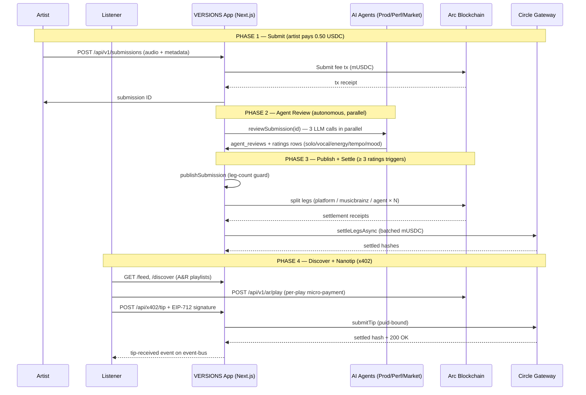
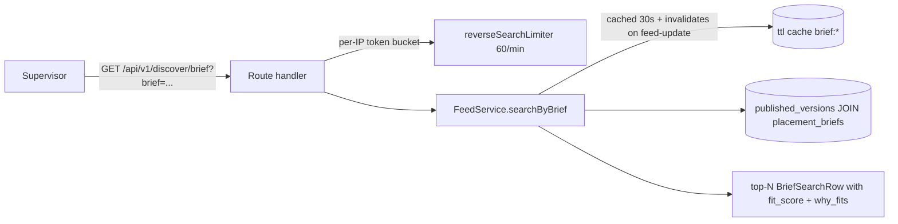

# VERSIONS · Next.js (production architecture)

VERSIONS is the **autonomous curation and per-play settlement layer for
music licensing**. It is a sync-first search engine: music supervisors,
A&R teams, and sync houses paste a plain-English brief and get ranked,
license-ready matches from a catalog of alternate takes. Artists submit
versions; AI agents review and rank them; and Arc USDC settles every
payment — submission fees, agent payouts, per-play royalties, and
listener tips — with no human in the loop.

Strategically, VERSIONS is a **wedge from an agentic primitive**: the
"autonomous brief → licensed-track pipeline with per-play micro-settlement"
is a picks-and-shovels primitive that incumbents (labels, production-music
catalogs, DSPs) are structurally disincentivized to build — pursuing it
cannibalizes their curated-catalog premium and their human-sync labor
model. The consumer-facing catalog is our beachhead and distribution, not
the business model. The moat is a compounding ground-truth dataset plus
settlement liquidity plus zero-marginal-cost scale. See
[STRATEGY.md](./STRATEGY.md) for the full thesis.

This repo is the production-grade rebuild of the VERSIONS Lepton
Submission Marketplace, ported from the vanilla Node.js + SQLite +
browser-ESM architecture at `../versions` to **Next.js 16.3** with
**PostgreSQL** (Neon serverless), **NextAuth v5** (wallet credentials),
**Wagmi v2** + **RainbowKit**, **Drizzle ORM**, and the **Vercel AI SDK**.

---

## Circle "Build on Arc" Hackathon — Agentic Economy Track

VERSIONS is a fully autonomous music A&R pipeline where **AI agents
review, rank, and publish music** and **Arc USDC settles every
payment** — submission fees, agent payouts, per-play royalties, and
listener tips — with zero human intervention.

### Why this wins the Agentic Economy track

This build is the working **proof of the primitive** behind VERSIONS: three
fully autonomous agents and every money movement settling on Arc. The
agents and the economy ticker are not the product pitch — they are the
evidence that the agentic pipeline is real, replayable, and can own the
ground-truth data incumbents can't. See **Strategy & positioning** below.

- **Three autonomous AI agents** (Production, Performance, Market)
  review every submission in parallel, score it on a 5-axis rubric,
  and auto-publish when all three agree — no human curator in the loop.
- **A fourth agent** (A&R) generates curated playlists from the published
  catalog and pays per-play royalties to artists on Arc.
- **Every money movement is on Arc**: submission fees (x402),
  agent/curator payouts (settlement legs), per-play royalties, and
  listener nanopayments (x402 tips) all settle as real USDC transfers
  on the Arc L1.
- **Licenses are ERC-8183 jobs**: requesting a sync license opens an
  Agentic Commerce job; settling runs Open → Funded → Submitted →
  Completed with a deliverable hash of (brief + take + usage). Job IDs
  and ArcScan links surface on the supervisor dashboard.
- **Agents have ERC-8004 identity**: Production / Performance / Market
  expose stable on-chain agent IDs in the Discover agent trace
  (`GET /api/v1/agents/identities`).
- **Live economy ticker**: the landing page shows a real-time feed of
  agent verdicts, verified tips, on-chain settlements, and pay-per-play
  events as they happen — with ArcScan tx links and honest mock badges.
- **Staged verdict reveal**: when a judge selects a submission, agent
  review cards animate in one by one as each agent finishes, and a
  pipeline stepper (Submit → Pay → Review → Publish → Settle) shows the
  exact lifecycle position.
- **App Kit sync budget**: supervisors fund the Arc treasury via
  Circle App Kit **Send** (USDC on Arc) or **Unified Balance**
  (deposit Base Sepolia → spend on Arc) from the Dashboard.
- **Agent Stack surface**: Dashboard lists agent wallets + ERC-8004
  identity IDs (payees for x402 score fees and settlement legs).
- **x402 nanopayments**: listeners tip artists as little as 1 lepton
  ($0.000001) using the x402 protocol with EIP-712 signatures, batched
  into on-chain USDC transfers with inline settlement confirmation.
  Signed-in supervisors can also pay **$0.05 USDC via x402** to run
  3-agent brief scoring (`POST /api/x402/score`) — AI work as a
  micropayment, not only tips. Guests keep free search.

### Quick start for judges (zero dependencies)

```bash
npm install
npm run db:push     # creates the PGlite local DB (no external Postgres needed)
npm run dev         # starts on http://localhost:3000
```

With no env vars set, every adapter runs in **mock mode** — the full
demo loop (submit → pay → review → publish → tip) works end-to-end with
deterministic mock data. Check mock status at `GET /api/health/ready`.

To run the self-driving demo loop:

```bash
pnpm demo           # auto-submits, pays, reviews, publishes, and tips
```

### Going real on Arc testnet

> **Arc network timeline.** VERSIONS currently settles on **Arc testnet**
> (network live with testnet USDC). **Arc mainnet launches September 16,
> 2026.** Until then use the testnet `ARC_RPC_URL` / `ARC_USDC_CONTRACT`
> below; after Sept 16 follow the go-mainnet checklist in the
> [Arc L1 settlement](#arc-l1-settlement) section.

Set these env vars to switch from mock to real on-chain settlement:

```
ARC_RPC_URL=https://rpc.testnet.arc.network
ARC_USDC_CONTRACT=0x3600000000000000000000000000000000000000
PLATFORM_WALLET=0x...                    # funded testnet wallet
PLATFORM_WALLET_PRIVATE_KEY=0x...         # hot wallet key (testnet only)
AGENT_KEY_SEED=any-secret-string          # gives each agent its own signing wallet
```

See `.env.example` for the full list. The health endpoint
(`GET /api/health/ready`) reports `arc.mock`, `signerConfigured`, and
`platformBalance` so you can verify real-mode status at a glance.

**One-command readiness check** (new):

```bash
npm run check:arc
```

Prints mock/live flags, chain id, USDC contract, platform balance, and
signer status; exits `0` only when live Arc is configured and
reachable. Go-live checklist for the demo:

1. `npm run check:arc` → exits 0 (if it exits 1, the demo still runs
   in mock — settlements will be deterministic mock hashes).
2. Fund `PLATFORM_WALLET` with testnet USDC on the RPC's chain; verify
   `platformUsdcBalance` prints a non-zero value.
3. Set `AGENT_KEY_SEED` (or per-agent `AGENT_WALLET_*` + keys) so agent
   payout legs sign from real wallets instead of falling back to mock.
4. Run the demo loop (`pnpm demo` or the in-browser LiveDemo button)
   and watch the ticker emit `leg_settled` / `tip_batch_settled` events
   with real ArcScan links (no `mock` badge).

### Wallet-free supervisor journey (guest sessions)

Supervisors can search, save briefs, log searches, and mark licensing
interests **without connecting a wallet**. The client keeps a per-device
ID in `localStorage` and sends it as the `x-supervisor-guest` header;
the server derives a deterministic pseudo-wallet
(`src/lib/supervisor-identity.ts`) and routes the row through the same
`supervisor_wallet` tables — zero schema change. A connected wallet
takes precedence over the guest header, so wallet sign-in is an
optional cross-device upgrade rather than a gate. Guest rows are
per-device by design; they are not merged when a wallet later connects
(demo-stage trade-off).

## Stack

- **Next.js** 16.3.0 (App Router, Turbopack, React 19.2)
- **TypeScript** 5, strict
- **Tailwind CSS** v4 with the VERSIONS design system (cream / ink / rust, Fraunces serif, JetBrains Mono)
- **Drizzle ORM** + `@neondatabase/serverless`
- **NextAuth v5** beta with `Credentials` provider for wallet signatures
- **Wagmi v2** + **RainbowKit** for wallet UX
- **Vercel AI SDK** (`ai`, `@ai-sdk/openai`) for the curator agents
- **Zod** for validation
- **Framer Motion** for kinetic transitions (parallax, scroll reveals)

## The VERSIONS demo loop

The full VERSIONS autonomous curation loop, end to end, in four phases.
The primary customer is the music supervisor; the primary action is
searching the catalog by brief. Stripe-style x402 nanopayments and
Circle Gateway batched settlement drop into a submit → review → publish
→ discover flow.


```mermaid
sequenceDiagram
    participant Artist
    participant Listener
    participant VERSIONS as VERSIONS App (Next.js)
    participant Agents as AI Agents (Prod/Perf/Market)
    participant Arc as Arc Blockchain
    participant Gateway as Circle Gateway

    Note over Artist,Gateway: PHASE 1 — Submit (artist pays 0.50 USDC)
    Artist->>VERSIONS: POST /api/v1/submissions (audio + metadata)
    VERSIONS->>Arc: Submit fee tx (mUSDC)
    Arc-->>VERSIONS: tx receipt
    VERSIONS->>Artist: submission ID

    Note over VERSIONS,Agents: PHASE 2 — Agent Review (autonomous, parallel)
    VERSIONS->>Agents: reviewSubmission(id) — 3 LLM calls in parallel
    Agents->>VERSIONS: agent_reviews + ratings rows (solo/vocal/energy/tempo/mood)

    Note over VERSIONS,Arc: PHASE 3 — Publish + Settle (≥ 3 ratings triggers)
    VERSIONS->>VERSIONS: publishSubmission (leg-count guard)
    VERSIONS->>Arc: split legs (platform / musicbrainz / agent × N)
    Arc-->>VERSIONS: settlement receipts
    VERSIONS->>Gateway: settleLegsAsync (batched mUSDC)
    Gateway-->>VERSIONS: settled hashes

    Note over Listener,Gateway: PHASE 4 — Discover + Nanotip (x402)
    Listener->>VERSIONS: GET /feed, /discover (A&R playlists)
    Listener->>Arc: POST /api/v1/ar/play (per-play micro-payment)
    Listener->>VERSIONS: POST /api/x402/tip + EIP-712 signature
    VERSIONS->>Gateway: submitTip (puid-bound)
    Gateway-->>VERSIONS: settled hash + 200 OK
    VERSIONS-->>Listener: tip-received event on event-bus
```

Every state transition is publish-gated; the leg-count formula is
single-sourced from `expectedLegCountFor(curatorCount)`; the sweeper
recovers any legs stuck `pending` beyond 30 s; and every x402 tip is
replay-protected by a unique `puid` index.

## Strategy & positioning

VERSIONS is **sync-first and B2B-first**, positioned as a
**picks-and-shovels wedge built on an agentic primitive** — not as a
catalog marketplace competing on library size.

**The wedge — one agentic primitive.** The primitive is an *autonomous
brief → licensed-track pipeline*: paste a brief, and three AI agents rank
the long tail of alternate takes by fit — with a `why_fits` rationale, per
take — and settle per-play micro-payments on Arc USDC. We sell the
*outcome* (pre-cleared, attributed, micro-settled licenses) that
incumbents can't cheaply reproduce.

**Why incumbents are structurally disincentivized (innovator's dilemma).**
Labels and production-music catalogs monetize premium curated catalogs and
human sync teams; autonomously clearing and micro-licensing the long tail
cannibalizes that margin and that labor model. DSPs under-invest because
sync licensing is a messy "schlep" that conflicts with their ad/sub model.
The result: the primitive stays un-cloned.

**Moat.** The compounding asset is the **ground-truth dataset** —
brief→fit verdicts and accept/reject/license-won feedback, cross-catalog —
which is a two-sided data network effect. Underneath it: zero-marginal-cost
scale (ranking track #N costs ~nothing) and **settlement liquidity**. Our
bet is to become *the memory of what actually licenses and settles, per
take, per play.*

**Marketplace = beachhead + distribution, not the business model.** The
supervisor surface is where we win a niche, generate the ground-truth data,
and earn pricing leverage. Distribution is built into the product: x402
settlement is a visible brand moment (Stripe-style), the live ticker is
proof-of-life, and each catalog integration is a channel. We aim to be the
**best operator, not a network-neutral rail** — win our own catalog first,
then let others consume the outcome.

**Primary motion:** supervisors and A&R teams paste briefs → artists
submit versions → AI agents tag and rank → supervisors license tracks.

**Secondary motion:** listeners browse the feed, play tracks, and tip
artists. This is not the business model; it is a live demo of the catalog
and a future data layer.

The full thesis — Thiel's monopoly-vs-commodity test and building
distribution into the product, Graham's "schlep," the moat mechanics, the
beachhead→expand path, and honest risks — lives in
[STRATEGY.md](./STRATEGY.md). The versioned primitive contract — the wedge
external catalogs could consume — is specified in
[docs/primitive-api.md](./docs/primitive-api.md). The beachhead bootstrapping
playbook (vertical slice, recruiting script, label capture, success metrics)
is in [docs/beachhead.md](./docs/beachhead.md).

## Build commands

```bash
npm install
npm run dev      # next dev .
npm run build    # next build . (standalone output)
npm start        # next start .
npm test         # vitest (362 tests: 359 unit + 3 integration)
npm run db:push  # drizzle-kit push
npm run db:studio
pnpm demo        # self-driving submit → pay → review → publish → tip loop (assumes `pnpm run dev` is up + `pnpm db:push` has been run)
```

## Environment

Copy `.env.example` to `.env` and fill in. The full variable list with
descriptions is in `.env.example`; the essential ones are:

```
DATABASE_URL=postgresql://...       # Neon pooled connection string
NEXTAUTH_SECRET=                    # openssl rand -base64 32
NEXTAUTH_URL=http://localhost:3000
NEXT_PUBLIC_WC_PROJECT_ID=          # WalletConnect Cloud project id (for mobile wallets)
ARC_RPC_URL=https://...             # Arc testnet/mainnet RPC (omit for mock mode)
ARC_USDC_CONTRACT=0x...             # mUSDC contract on Arc (omit for mock)
PLATFORM_WALLET=0x...               # Fee recipient wallet (omit for mock)
PLATFORM_WALLET_PRIVATE_KEY=...     # Optional server-side signer for automated settlement (hot wallet — rotate/restrict post-demo)
# Note: without PLATFORM_WALLET_PRIVATE_KEY, settlement legs still produce deterministic mock hashes even when ARC_RPC_URL is live.
LLM_API_KEY=...                     # Curator agent LLM (omit for mock mode)
PINATA_JWT=...                      # Pinata JWT for IPFS uploads (omit for local-only)
```

### WalletConnect Project ID

`NEXT_PUBLIC_WC_PROJECT_ID` is required for RainbowKit to offer
WalletConnect-compatible wallets (mobile wallets via QR code). Without
it, only browser-extension wallets (MetaMask, Coinbase Wallet, etc.)
work. Get a free project ID at [cloud.walletconnect.com](https://cloud.walletconnect.com/).

### Mock mode

All external adapters are **mock-first**: omitting their env vars
falls back to deterministic mock mode so the full demo loop runs with
zero external dependencies. See `.env.example` for the complete list.

## Seeded demo catalog

`npm run seed` (or `npx tsx scripts/seed-catalog.ts`) populates a
non-empty catalog: 8 submissions (1 awaiting curation, 7 published)
across rock, electronic, folk, hip-hop, synthwave, Americana, R&B, and
indie-folk — each with 3 agent reviews, a placement brief for the
inverse-search, and a **playable silent WAV** written to the uploads dir
(`data/uploads/seed-<id>.wav`; the old fictional `seeds/*.mp3` paths
404'd in the AudioPlayer and are repointed on re-seed).

The Discover page ships one-click **example briefs**
(`src/lib/example-briefs.ts`) tuned to the seeded placement briefs, so
a cold visitor can paste a realistic supervisor query in one click.

## Routes

| Route | Purpose |
| --- | --- |
| `/` | Brand-forward landing with live economy ticker + 4-section nav |
| `/submit` | Submit a version (audio upload + metadata + 0.50 USDC fee) |
| `/agents` | Agent monitor — watch AI agents review the queue in real time + economy ticker |
| `/feed` | Published versions with mood/energy/tempo filters |
| `/discover` | A&R agent playlists with per-play micro-payments |
| `/api/health` | Service health probe |
| `/api/health/ready` | Detailed readiness probe (arc.mock, llm.mock, signerConfigured, etc.) |
| `/api/events` | SSE stream for real-time feed + queue + economy events |
| `/api/economy/activity` | Recent economy activity (reviews, tips, settlements, plays) for ticker initial load |
| `/api/v1/feed` | List published submissions (filtered) |
| `/api/v1/submissions` | Create / list submissions |
| `/api/v1/submissions/queue` | Curation queue |
| `/api/v1/submissions/[id]/verify-payment` | Verify on-chain payment |
| `/api/v1/submissions/[id]/claim` | Claim a submission for curation |
| `/api/v1/submissions/[id]/rate` | Submit a rating |
| `/api/v1/submissions/[id]/reviews` | Agent reviews for a submission |
| `/api/v1/submissions/[id]/brief` | Placement brief |
| `/api/v1/versions/[id]` | Single published version |
| `/api/v1/ar/playlists` | A&R playlists |
| `/api/v1/ar/playlists/generate` | Generate new playlists via LLM |
| `/api/v1/ar/play` | Record a play (micro-payment) |
| `/api/v1/artists/[wallet]/versions` | Artist dashboard — versions |
| `/api/v1/artists/[wallet]/earnings` | Artist dashboard — earnings |
| `/api/v1/discover/brief` | Supervisor inverse-search — paste a brief, get ranked matches |
| `/api/v1/embeddings/backfill` | Embeddings status (GET) + catalog backfill (POST) |
| `/api/v1/arc/info` | Arc chain info (mock or live) |
| `/api/telemetry` | Client-side funnel analytics beacon |
| `/api/auth/[...nextauth]` | NextAuth handler (wallet credentials) |

## Project layout

```
src/
├── app/                      # App Router
│   ├── api/                  # Route handlers
│   │   ├── v1/               # Versioned API surface
│   │   ├── events/           # SSE endpoint
│   │   └── x402/             # nanopayment tip route (x402 + Circle Gateway)
│   ├── agents/               # Agent monitor dashboard
│   ├── discover/             # A&R playlists page
│   ├── feed/                 # Published feed page
│   ├── submit/               # Submission form page
│   ├── globals.css           # Tailwind v4 design system
│   ├── layout.tsx            # Root layout
│   ├── not-found.tsx         # 404
│   ├── page.tsx              # Landing
│   └── providers.tsx         # Session + Wagmi + RainbowKit + Query
├── components/
│   ├── audio/                # AudioPlayer
│   ├── cover/                # Cover SVG rendering
│   ├── curation/             # AgentMonitor, TasteGraph, etc.
│   ├── discovery/            # DiscoverView (A&R playlists)
│   ├── feed/                 # FeedView
│   ├── submit/               # SubmitForm
│   ├── ui/                   # Shared UI (Toast, etc.)
│   ├── wallet/               # Wallet connection components
│   └── SiteHeader.tsx        # Shared header + tab nav
├── services/
│   ├── submissions.ts        # Create, verify payment, list queue
│   ├── curation.ts           # Claim, rate, publish
│   ├── feed.ts               # List published versions
│   ├── settlement.ts         # Fee split + settlement legs
│   ├── agents.ts             # AI agent auto-review
│   ├── ar.ts                 # A&R playlist generation
│   ├── tips.ts               # x402 nanotip batch settler
│   └── taste-graph.ts        # Rating aggregation
├── adapters/
│   ├── arc.ts                # Arc blockchain adapter (multi-signer)
│   └── llm.ts                # LLM adapter (agent reviews)
├── lib/
│   ├── api-client.ts         # Typed fetch client
│   ├── cache.ts              # In-process TTL cache w/ event-bus invalidation
│   ├── config.ts             # Env helpers
│   ├── db.ts                 # Neon + Drizzle client
│   ├── event-bus.ts          # In-process pub/sub (SSE backing)
│   ├── ipfs.ts               # Pinata IPFS upload
│   ├── logger.ts             # Structured logging
│   ├── multipart.ts          # Multipart form parsing
│   ├── rate-limit.ts         # Per-IP token-bucket rate limiter
│   ├── schema.ts             # Drizzle schema (12 tables)
│   ├── transaction.ts        # Logical transaction wrapper (compensating rollback)
│   ├── types.ts              # Shared TS types
│   ├── utils.ts              # escapeHtml, cn, etc.
│   ├── validation.ts         # Zod rating validation
│   ├── wagmi.ts              # Wagmi config
│   └── x402.ts               # EIP-712 challenge + verify for nanopayment tips
```

## Migration notes

The migration from the vanilla Node.js proxy to Next.js is complete.
The old `versions-next/` scaffolding directory has been removed.
For the pre-migration project history, see commits before `7b05e333`.
### Remaining work

- [ ] WalletConnect project ID (`NEXT_PUBLIC_WC_PROJECT_ID`) — get one from [cloud.walletconnect.com](https://cloud.walletconnect.com/) (see Environment section above)
- [ ] Funded Arc testnet wallet (`PLATFORM_WALLET_PRIVATE_KEY`) for real on-chain settlement demo
- [x] Production deployment config — `netlify.toml` for Netlify + `Dockerfile` for any container platform
- [x] Live economy ticker (SSE + ArcScan links)
- [x] Submission pipeline stepper (Submit → Pay → Review → Publish → Settle)
- [x] x402 settlement confirmation UI (inline tx link)
- [x] Staged verdict reveal (framer-motion staggered agent cards)
- [x] Build verification (all 18 routes prerender, 362 tests pass)

## Publish pipeline hardening

The settlement pipeline has been hardened against double-publish races and
partial-publish state. Key invariants:

- **`uq_legs_submission_wallet_role`** — Postgres unique index on
  `settlement_legs(submission_id, recipient_wallet, recipient_role)`. The
  composite key is required because the same wallet can legitimately appear
  in multiple roles (e.g. the artist is both the `musicbrainz` recipient
  and the `platform` fallback). DDL is mirrored in `tests/helpers/db.ts`.
- **`PublishLegIncompleteError`** — named error class thrown by
  `publishSubmission` when the leg-count guard detects a partial insert.
  Carries `submissionId`, `expected`, `actual`, and `actualLegIds` so
  upstream callers (`curation.ts submitRating`, `agents.ts
  reviewSubmission`) can detect it via `instanceof` and return a
  structured `{ ok: false, error, code: 'publish_legs_incomplete' }`
  response.
- **`expectedLegCountFor(curatorCount)`** — single source of truth for
  the leg-count formula (`curatorCount + 2 = 1 platform + 1
  musicbrainz`). Used by the under-count guard, the over-count warning
  log, and `settlement.splitFee`'s minimum-count check so the "+2"
  invariant can't drift between call sites.
- **`transactional()` wrapper** — logical transaction for Neon HTTP.
  Services that make multi-step DB writes (rating → count → publish →
  leg) wrap their work in `transactional()` so a failure rolls back
  partial state via compensating actions instead of leaving orphan rows.
- **Over-count soft warning** — when orphan legs with `(wallet, role)`
  combos the build doesn't generate are present, the publish still
  succeeds but `log.warn` emits `extraLegIds` / `extraLegKeys` (via set
  difference against the expected keys) so stale rows are traceable
  for cleanup.

## Arc L1 settlement

Submission fees and curator/artist payouts settle on Arc via USDC. The
settlement service splits each submission fee into curator, platform, and
artist legs and drives each leg through `src/adapters/arc.ts`.

- **Mock-first** — omitting `ARC_RPC_URL` keeps the demo loop green with
deterministic hashes.
- **Real-mode server-side signing** — when `ARC_RPC_URL`,
`ARC_USDC_CONTRACT`, `PLATFORM_WALLET`, and `PLATFORM_WALLET_PRIVATE_KEY`
are set, the adapter signs and broadcasts real ERC-20 transfer transactions
from the platform treasury wallet. The private key is validated against the
`from` address so a mismatched key fails fast.
- **Dynamic chain** — the adapter reads `eth_chainId` from the configured
RPC and builds the viem `Chain` at runtime, so testnet/mainnet RPCs are
both supported without hardcoding.
- **Network timeline** — currently **Arc testnet**; **Arc mainnet launches
September 16, 2026**. Testnet RPC/contract values are in the
"Going real on Arc testnet" section. To go mainnet after Sept 16:
(1) set the mainnet `ARC_RPC_URL` + `ARC_USDC_CONTRACT` in `.env`,
(2) point `NEXT_PUBLIC_ARC_RPC_URL` / `NEXT_PUBLIC_ARC_EXPLORER_URL` at
mainnet and **rebuild** the image (they're inlined at build time), and
(3) use a funded hot wallet — `npm run check:arc` should exit `0` and
`platformUsdcBalance` should be non-zero.
- **Health probe** — `GET /api/health/ready` reports `arc.reachable`,
`chainId`, `platformBalance`, and `signerConfigured`. If real Arc is
configured but unreachable, the endpoint returns HTTP 503 with
`status: "degraded"`.

## Nanopayments (x402 + on-chain batch settlement)

### Live economy ticker

The landing page and agents page show a **real-time economy ticker** that
streams agent verdicts, verified tips, on-chain settlements, and
pay-per-play events as they happen:

- **SSE-backed**: subscribes to `/api/events` for `economy-event` updates
  and fetches `/api/economy/activity` for initial content on load
- **5 event kinds**: `review` (agent verdict), `tip` (x402 verified),
  `tip_batch_settled` (on-chain batch), `leg_settled` (payout leg),
  `play` (per-play royalty)
- **ArcScan links**: every event with a tx hash links to the explorer
- **Honest mock badges**: mock events are badged so the demo never
  overclaims on-chain finality
- **Emitted from 5 service points**: `agents.ts` (review), `tip/route.ts`
  (tip), `tips.ts` (batch settled), `settlement.ts` (leg settled),
  `ar.ts` (play)

Files: `src/components/economy/EconomyTicker.tsx`,
`src/app/api/economy/activity/route.ts`, `src/lib/event-bus.ts` (EconomyEvent),
`src/lib/explorer.ts` (txUrl helper), `src/lib/agent-identity.ts`.

### Submission pipeline stepper

The agent monitor shows a **horizontal pipeline stepper** for the selected
submission, deriving stage states from the submission status + agent rating
count: Submit → Pay → Agent Review (X/3) → Publish → Settle. Queue rows gain
inline status chips so judges can see the lifecycle position at a glance.

Files: `src/components/economy/PipelineStepper.tsx`.

### x402 settlement confirmation

After a listener tips an artist, the TipButton shows an **inline settlement
confirmation** with the tx hash and an ArcScan link, auto-clearing after 8
seconds. Mock tips are badged honestly ("Tip recorded (mock)").

Files: `src/components/wallet/TipButton.tsx`.

### Staged verdict reveal

When a judge selects a submission, agent review cards **animate in with a
staggered reveal** (120 ms per card) using framer-motion. When a new agent
verdict arrives over SSE while the judge is watching, the review pane
auto-refreshes and the new card animates in.

Files: `src/components/curation/AgentMonitor.tsx`.

### Musical interactions (Web Audio)

The landing page is itself an instrument — inspired by Codrops'
MusicalInteractions, built with zero audio files and zero new deps
(pure Web Audio oscillator synthesis):

- **Playable waveform hero**: clicking/tapping the waveform gallery
  plays a pitched note — vertical position maps to an 8-note C-major
  scale (C4 at the bottom → C5 at the top) with a ripple animation at
  the touch point. `touch-pan-y` keeps vertical scroll working on
  mobile.
- **Economy event chimes**: each SSE `economy-event` kind has its own
  sound — agent review (E4+G4 dyad), verified tip (C5), on-chain
  settlement (C-E-G triad), per-play royalty (G5). Off by default;
  the ♪ toggle on the economy ticker opts in (and resumes the
  AudioContext inside the user gesture, as browsers require).
- **Envelope synthesis**: every tone is an oscillator with a short
  attack-decay gain envelope, so chimes stay soft and non-fatiguing
  during a busy demo.

Files: `src/lib/audio-feedback.ts` (synth engine),
`src/components/home/WaveformGallery.tsx` (playable hero),
`src/components/economy/EconomyTicker.tsx` (sound toggle + chimes).

The artist dashboard exposes a **Tip** button that lets a listener send a
sub-cent USDC nanopayment to any artist on Arc. The flow uses the
[x402 protocol](https://docs.x402.org) with a DB-queued **batch settler**
that aggregates tips into real on-chain USDC transfers:

1. **Client → Server (no payment proof):** `POST /api/x402/tip` with
   `{artistWallet, amountUsdc}`. The route returns **HTTP 402** with a
   `PAYMENT-REQUIRED` header (Base64 JSON) containing the EIP-712
   challenge — the offer the client must sign.
2. **Client signs the offer** with `useSignTypedData` from wagmi. The
   challenge carries the actual Arc `chainId` (not hardcoded to 1) so
   the wallet signs on its current chain.
3. **Client → Server (with payment proof):** Retry the same `POST` with
   a `PAYMENT-SIGNATURE` header (Base64 JSON `{scheme, signature,
   offer}`). The server:
   - decodes and re-validates the challenge (same `payTo`, `amount`,
     `puid`, `validUntil`)
   - recovers the tipper wallet from the EIP-712 signature
   - persists the proof to `x402_proofs` (replay-protected by a
     unique index on `puid`) — verified rows ARE the settlement queue
   - **aggregates every queued tip for the artist into ONE on-chain
     USDC transfer** (platform → artist) via the arc adapter, flipping
     the rows to `settled` with the shared tx hash
   - emits a `tip-received` event on the bus for real-time dashboards

   A failed batch leaves rows `verified` (queued); the settlement
   sweeper (`/api/cron/sweep`) retries them via `tips.flushAll()`.

### Amounts and the lepton primitive

USDC has 6 decimals. The smallest unit — **1 lepton** = `$0.000001` =
`1` micro-USDC — is the settlement floor. Presets on the TipButton:

- **1 lepton** (`$0.000001`) — literally the smallest settleable unit
- **1¢** (`$0.01`) = 10,000 leptons
- **5¢** (`$0.05`) = 50,000 leptons
- **25¢** (`$0.25`) = 250,000 leptons
- **Custom** — any decimal string, per-tip cap is `$1.00`

### Environment variables

Tip settlement rides the same Arc envs as the rest of settlement
(`ARC_RPC_URL`, `ARC_USDC_CONTRACT`, `PLATFORM_WALLET`,
`PLATFORM_WALLET_PRIVATE_KEY`). No separate gateway config exists.
With no `ARC_RPC_URL`, batches settle as deterministic mocks tagged
`mock: true` so the demo and tests are reproducible.

### Files

- `src/lib/x402.ts` — EIP-712 domain/types, `verifyProof`, `offerMatches`,
  `parseAmountToMicroUsdc`, `formatMicroUsdc`, base64 header codecs
- `src/services/tips.ts` — batch settler (`settleQueuedFor`, `flushAll`,
  `getTipStatus`)
- `src/app/api/x402/tip/route.ts` — the two-shot route
- `src/components/wallet/TipButton.tsx` — the client UI
- `src/lib/format.ts` — `fmtLeptons` (sub-cent formatter)
- `src/lib/event-bus.ts` — `'tip-received'` event
- `src/lib/schema.ts` — `x402_proofs` table
- `tests/unit/x402.test.ts` — verifyProof with a real viem test wallet,
  route 402/200/401/409; `tests/unit/tips.test.ts` — batch aggregation,
  retry, idempotency

## Supervisor inverse-search

The market agent now emits a sync-grounded `placement_brief` per
published version: `scene_tags` (≤8 short noun phrases), `instruments`
(≤16 controlled vocab like `guitar_led`), `emotional_arcs` (≤5 free-text),
`sync_comparables` (`[ {name, why} ]`), and `audience_summary`. A
supervisor in the field pastes a plain-English brief and the platform
returns ranked matches with `why_fits` citations.


```mermaid
flowchart LR
  Supervisor -->|GET /api/v1/discover/brief?brief=...| Route[Route handler]
  Route -->|per-IP token bucket| Limiter[reverseSearchLimiter 60/min]
  Route --> BriefSearch[FeedService.searchByBrief]
  BriefSearch -->|cached 30s + invalidates on feed-update| Cache[(ttl cache brief:*)]
  BriefSearch --> PV[(published_versions JOIN placement_briefs)]
  BriefSearch --> Rows[top-N BriefSearchRow with fit_score + why_fits]
```

### Scoring (v1, structured-tag overlap)

| hit | weight |
| --- | --- |
| scene_tag (`tokens.some(t => tag.includes(t))`) | +3 |
| instrument (`tokens.some(t => t===inst \|\| inst.includes(t))`) | +2 |
| emotional_arc (substring) | +1 |
| audience_summary substring | +1 |
| popularity tiebreaker | 0.1 × rating_count |
| recency tiebreaker | 0.05 × max(0, 30 − daysSince) |

Tiebreaker nudges are bounded so popularity + recency never override a
real overweight signal.

### Route invariants

- `brief` length **3-500** chars → 400 `INVALID_BRIEF` otherwise
- per-IP rate-limit **60 req / min** → 429 `RATE_LIMITED` otherwise
- 200 OK envelope on hit: `{ success: true, data: { total, limit, offset, rows[] } }`
- rows are sorted by `fit_score` DESC, then by `published_at` DESC
- result rows are cached 30 s under `brief:*`; `feed-update` event wipes every key so a publish invalidates the index surface non-stale

### Wire shape — `BriefSearchRow` (snake_case)

- `submission_id, title, artist_name, version_type, audio_path, cover_svg,
  avg_solo_intensity, avg_vocal_quality, energy_consensus, tempo_consensus,
  rating_count, aggregated_mood_tags, published_at (ISO)`
- `fit_score` (rounded to 2dp); `why_fits` (≤3 plain-language citations, e.g. `scene: car chase`,
  `instrument: guitar_led`, `summary match`)
- `brief` block: `{ scene_tags, instruments, emotional_arcs, sync_comparables: [{name, why}],
  audience_summary }`

### Files

- `src/app/api/v1/discover/brief/route.ts` — `GET` handler
- `src/services/feed.ts` — `searchByBrief` + tokenize + scoreAgainstBrief + explainFit + briefCacheKey
- `src/lib/types.ts` — `BriefSearchRow` + `BriefSearchResponse` + canonical `MoodTagsEnvelope`
- `src/lib/api-client.ts` — `searchByBrief` wire helper (CSV filters, snake_case params)
- `src/components/discovery/DiscoverView.tsx` — `MatchSearch` panel (textarea + char-counter + result cards)
- `tests/unit/feed.test.ts` — service-level coverage (match / stop-words short-circuit / cache invalidation)
- `tests/unit/discover-brief.test.ts` — route-level coverage (400 bounds, 200 wire lock, 429 burst)
- `src/lib/event-bus.ts` — `feed-update` event invalidates both `feed:*` and `brief:*` cache keys

## Roadmap (Week 3+)

The supervisor inverse-search supports both **structured-tag overlap**
(v1, always available) and **CLAP semantic audio similarity** (v2, when
embeddings are configured). The semantic layer is the primary ranking
signal; structured tags provide explainable `why_fits` citations.

### Semantic search (CLAP / pgvector)

When `EMBEDDING_API_URL` is set, the embedding adapter calls a hosted
CLAP API to embed both the supervisor's brief text and each published
version's audio into the same 512-dim vector space. The feed service
queries pgvector for cosine-distance nearest neighbors, then combines
the semantic similarity with the structured-tag score via a hybrid
scorer (semantic × 0.7 + structured × 0.3 + popularity/recency
tiebreakers). When embeddings are absent (mock mode, no pgvector, or
any DB error), the search gracefully falls back to structured-tag-only
scoring — no downtime, no broken results.

**Setup:**
```bash
npm run db:pgvector          # enable pgvector extension + create version_embeddings table
npm run db:push              # push the schema (version_embeddings table)
# Set EMBEDDING_API_URL + EMBEDDING_API_KEY in .env
# Backfill existing catalog:
#   curl -X POST http://localhost:3000/api/v1/embeddings/backfill
# Or call services().embeddings.embedAllPublished() from a script
```

**Files:**
- `src/adapters/embedding.ts` — mock-first CLAP adapter (embedAudio / embedText)
- `src/services/embeddings.ts` — backfill service (embedVersion / embedAllPublished / hasEmbeddings)
- `src/services/feed.ts` — hybrid scorer (cosineSimilarity + hybridScore pure functions, semantic search path in searchByBrief)
- `src/lib/schema.ts` — `version_embeddings` table with `vector(512)` column
- `scripts/create-pgvector-extension.sql` — extension + table + ivfflat index
- `tests/unit/embedding.test.ts` — adapter tests (mock mode: determinism, L2 norm, dimensions)
- `tests/unit/semantic-score.test.ts` — pure-function tests (cosine similarity, hybrid score weights)

### Up next

- **Arc mainnet go-live (Sept 16, 2026)** — once Arc mainnet launches,
  point `ARC_RPC_URL` / `ARC_USDC_CONTRACT` (and the `NEXT_PUBLIC_*`
  build args) at mainnet, fund the treasury hot wallet, and rerun
  `npm run check:arc` until it exits `0`.
- **`expectedLegCountFor` prophecy check** — add a Postgres-level invariant
  test that runs against the live DB on `npm run db:doctor` so orphan legs
  in production produce a deploy-blocking alert (catches the carryover from
  the publish-pipeline hardening round).

### Completed

- **Friction-reduction pass on Submit + Discover** — `SubmitForm` now shows
  **"Total cost: 0.50 USDC · No additional gas or hidden fees"** as the
  final cost, not a per-step surprise. `DiscoverView` MatchSearch panel
  notes "No wallet needed — search is free" so supervisors can paste a
  brief without a wallet-connect popup on first visit.
- **Brief telemetry → funnel** — the `brief_search` analytics event is
  wired into `/api/v1/funnel` via a new `supervisorFunnel` field in the
  `FunnelBreakdown` response. The funnel endpoint now reports both the
  artist funnel (page_view → nav_click → form_start → submit_attempt →
  submit_success) and the supervisor funnel (page_view → brief_search).
- **Auth signin page** — `/auth/signin` page implemented with
  wallet-signature-based sign-in that bridges RainbowKit's client-side
  connection with NextAuth's server-side session.
- **Embeddings backfill API route** — `POST /api/v1/embeddings/backfill`
  triggers a full-catalog CLAP embedding backfill; `GET` returns status
  (has_embeddings + mock flag).
- **Health/ready endpoint** — now reports `embedding.mock`,
  `gateway.mock` (arc-derived: on-chain tip settlement mock flag), and
  `ipfs.configured` alongside the existing `arc.mock`
  and `llm.mock` flags.
- **Dockerfile** — multi-stage Docker build with standalone Next.js output
  for deployment to any container platform.
- **Integration tests** — `tests/integration/full-loop.test.ts` exercises
  the full service-layer loop (submit → review → publish → feed → brief
  search) against the test PGlite DB.

### Watchlist

- **Embedding API provider selection** — the adapter is provider-agnostic
  (any HTTP endpoint that accepts `{ audio_url }` or `{ text }` and returns
  `{ embedding: number[] }`). Pin a specific provider (Replicate, HuggingFace
  Inference) once the catalog is live and benchmark latency + cost.
- **Globally-coherent rate limiting** — `rate-limit.ts` now supports Upstash
  Redis (`UPSTASH_REDIS_REST_URL` + `UPSTASH_REDIS_REST_TOKEN`). When unset,
  the in-memory limiter runs per-instance. Set both env vars to switch to
  globally-coherent rate limiting across serverless instances.

## Deploy runbook — Legacy placement_briefs purge

Commit `6f48d190` repurposed the four NOT NULL JSONB columns on
`placement_briefs` (`venues / youtube_channels / influencers / draft_emails`)
via Drizzle column-aliasing. Legacy rows predate the repurpose and may
still hold the OLD shape — `venues` used to be a venue-contact object
array (`{name, location, capacity}`), `draft_emails` a draft-outreach
array (`{to, subject, body}`), and `influencers` a contact object array
(`{twitter, followers}`). Drizzle won't crash on legacy rows but the
supervisor inverse-search via `services/feed.ts:searchByBrief` will
TypeError on `.map()` over the object arrays.

Run two commands before deploying `6f48d190` against any DB that was
seeded before the repurpose:

```bash
# 1. Dry-run — see the count of rows that look legacy
npm run db:purge:preview

# 2. Apply the wipe (BEGIN/COMMIT) — only if the count matches what you expect.
#    Snapshot first if you want a revert path:
#      pg_dump --table=placement_briefs "$DATABASE_URL" > brief.bak
npm run db:purge:apply
```

The WHERE predicate uses `jsonb_typeof(venues->0) <> 'string'` as the
proxy marker — legacy `venues` was an object array, post-repurpose
`venues` is a `string[]`. New-shape rows (already `string[]` or
empty) are skipped; `audience_summary` is never touched because its
TEXT shape carried over cleanly.

**Narrow-by-design caveat:** the predicate keys off `venues` only.
Rows whose `venues` is `[]` but whose `youtube_channels /
influencers / draft_emails` still carry legacy object arrays are
deliberately NOT wiped — they're functionally harmless because the
column-aliasing reads them as the new `string[]` shape and a
downstream `.map()` over an object array would have TypeError'd, but
any inert legacy objects are not in the hot path. If a paranoid
operator wants the OR-across-all-4-columns variant, broaden the
WHERE clause in `scripts/purge-legacy-placement-briefs.apply.sql`
and the matching test fixture in
`tests/unit/purge-legacy-briefs.test.ts`.

If `psql` isn't on your PATH (some operator envs), paste the contents
of `scripts/purge-legacy-placement-briefs.apply.sql` directly into the
Neon SQL Editor.

## Recent prod execution (2026-07-08)

Last verified run against the production Neon DB
(`ep-polished-flower-at3asl7k-pooler.c-9.us-east-1.aws.neon.tech`):

```bash
# Preview
npm run db:purge:preview
# → legacy_rows_to_purge = 0 / distinct_submissions_impacted = 0

# Apply (BEGIN/COMMIT atomic, idempotent)
npm run db:purge:apply
# → BEGIN / UPDATE 0 / COMMIT

# Verify
psql "$DATABASE_URL" -c "SELECT count(*) FROM placement_briefs;"
# → 0
```

Production was already in post-repurpose shape — `placement_briefs` has 0
rows total, so the apply was an idempotent no-op (`UPDATE 0`). The runbook
fired end-to-end against real Neon Postgres and committed cleanly. Operator
can ship `6f48d190` without needing a follow-up purge.

## Deploy runbook — DB migrations

Three SQL scripts must be run against the production DB before (or
alongside) `npm run db:push`. All are idempotent and safe to re-run.

### 1. Rename placement_briefs columns

Renames the legacy JSONB columns to their logical names
(`venues`→`scene_tags`, `youtube_channels`→`instruments`,
`influencers`→`emotional_arcs`, `draft_emails`→`sync_comparables`).
Required before `db:push` on any DB that still has the old column
names.

```bash
npm run db:rename-briefs
```

### 2. Enable pgvector (extension only) — **required before `db:migrate`**

Enables the `vector` extension. The baseline migration creates a
`version_embeddings` table whose `embedding` column is typed
`vector(512)`, so `npm run db:migrate` **hard-fails** until the
extension exists. Run this first on any fresh database:

```bash
npm run db:pgvector
```

The `version_embeddings` table is owned by the Drizzle migration
(`drizzle/0000_*.sql`) — this script only runs
`CREATE EXTENSION IF NOT EXISTS vector;` so there is no double-create
between `db:pgvector` and `db:migrate`. On other Postgres providers,
install the extension first: `CREATE EXTENSION vector;`.

> Note: `DROP SCHEMA public CASCADE` also drops the extension (it lives
> in the `public` schema). After resetting a database that way, re-run
> `npm run db:pgvector` before `db:migrate`.

**ivfflat index:** the Drizzle schema does not declare the
approximate-NN index, so the migration creates none. For catalogs
over ~10k embeddings, create it once manually:

```sql
CREATE INDEX IF NOT EXISTS idx_version_embeddings_vector
  ON version_embeddings USING ivfflat (embedding vector_cosine_ops)
  WITH (lists = 100);
```

### 3. Apply schema (migrate, not push, for forward changes)

A **baseline Drizzle migration set** is checked in at `drizzle/`
(`0000_friendly_harry_osborn.sql` + `0001`/`0002` forward migrations,
all 23 tables). The workflow for
**new schema changes** is generate → review → migrate, never push:

```bash
npm run db:generate   # write a new migration from src/lib/schema.ts
# review the SQL in drizzle/<timestamp>_*.sql (spot-check columns + unique indexes)
npm run db:migrate    # apply pending migrations
```

For **fresh databases** (CI, a new Neon branch, a local dev box), make
sure `npm run db:pgvector` ran first (§2), then `npm run db:migrate`
from the baseline creates everything — no `db:push` needed.

For **existing databases** that were previously kept in sync with
`npm run db:push`, the baseline must be marked as applied once so
`db:migrate` starts from a clean ledger:

```bash
psql "$DATABASE_URL" -c "CREATE TABLE IF NOT EXISTS drizzle.__drizzle_migrations (id serial PRIMARY KEY, hash text NOT NULL, created_at bigint);"
# then apply ONLY the drift-free forward migrations; or run
npm run db:push       # one last time on the drifted DB to align it, then db:migrate forward
```

(The migration ledger lives in the `drizzle` schema, not `public` — the
table above is `drizzle.__drizzle_migrations`. In practice, re-aligning a
heavily drifted database is faster done as a clean reset; see the
non-transactional note below.)

**Drift caveat:** `drizzle-kit push` still works for quick local demos, it
asks interactive questions when the live DB has drifted from
`src/lib/schema.ts`, and it fails with "Interactive prompts require a TTY"
in non-interactive shells — so run it from a real terminal. A drifted DB
will bite in specific ways: a missing `submissions.audio_sha256` column
500s the submit route, a missing `uq_legs_submission_wallet_role` unique
index makes publish roll back (its `ON CONFLICT` needs the index to
exist), and missing `x402_proofs` / `telemetry_events` tables break tips
and analytics. All of these are created by a clean `db:push`; if push
can't run, mirror the DDL from `src/lib/schema.ts` via `psql`. Prefer
`db:generate` + `db:migrate` for anything that outlives the demo.

**Migrate is non-transactional per file:** `drizzle-kit migrate` runs each
migration's statements without a wrapping transaction, so a failure
mid-file leaves partial tables and **no ledger entry** for that migration
(`drizzle.__drizzle_migrations` stays empty). Re-running then fails on
"relation already exists". Recovery is a clean reset: drop both schemas
(`DROP SCHEMA public CASCADE; DROP SCHEMA drizzle CASCADE;`), re-create
the `vector` extension, and re-run `db:migrate`.

### 4. Backfill embeddings (optional)

After enabling pgvector and setting `EMBEDDING_API_URL` +
`EMBEDDING_API_KEY`, backfill the existing catalog:

```bash
curl -X POST http://localhost:3000/api/v1/embeddings/backfill
```

Or check status without triggering a backfill:

```bash
curl http://localhost:3000/api/v1/embeddings/backfill
```

## Known issues

1. **`.env.example` is checked in** — it documents every env var referenced by `src/lib/config.ts` (Zod schema), `src/lib/services.ts`, `src/lib/ipfs.ts`, `src/lib/wagmi.ts`, and the submit-config pair. Copy it to `.env` and fill in the required values (`DATABASE_URL`, `NEXTAUTH_SECRET`). All adapter vars (Arc, LLM, Gateway, Pinata) are optional — omitting them runs the respective adapter in mock mode.
2. **Homebrew `pg_dump` version mismatch** — the local Homebrew `pg_dump` is `14.22` while the Neon server runs Postgres `18.4`. `pg_dump --table=placement_briefs "$DATABASE_URL" > brief.bak` aborts with `server version: 18.4; pg_dump version: 14.22` before producing any output, so the revert path documented in the Deploy runbook above does NOT work until the local client is upgraded to ≥18. **Inline `psql -c "..."` queries still work fine** against the 18 server (the smoke-update `BEGIN; UPDATE 0; COMMIT;` ran end-to-end on real Neon this way). Fix: `brew install postgresql@18 && brew link --force postgresql@18`.
