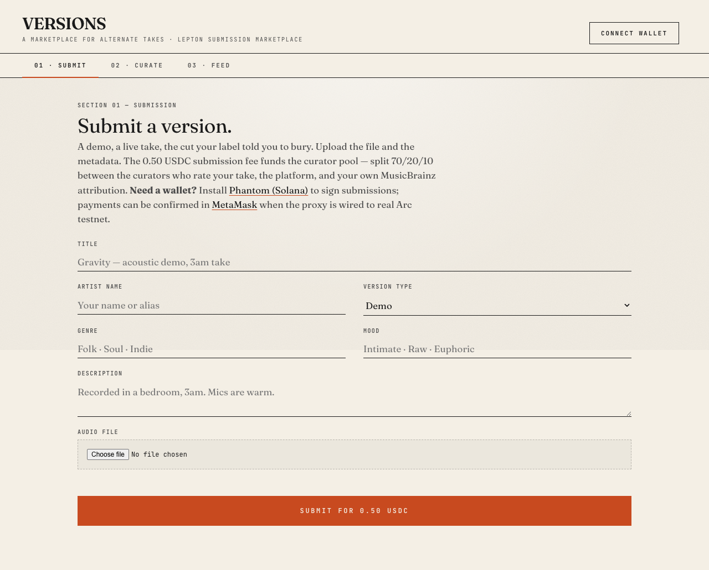
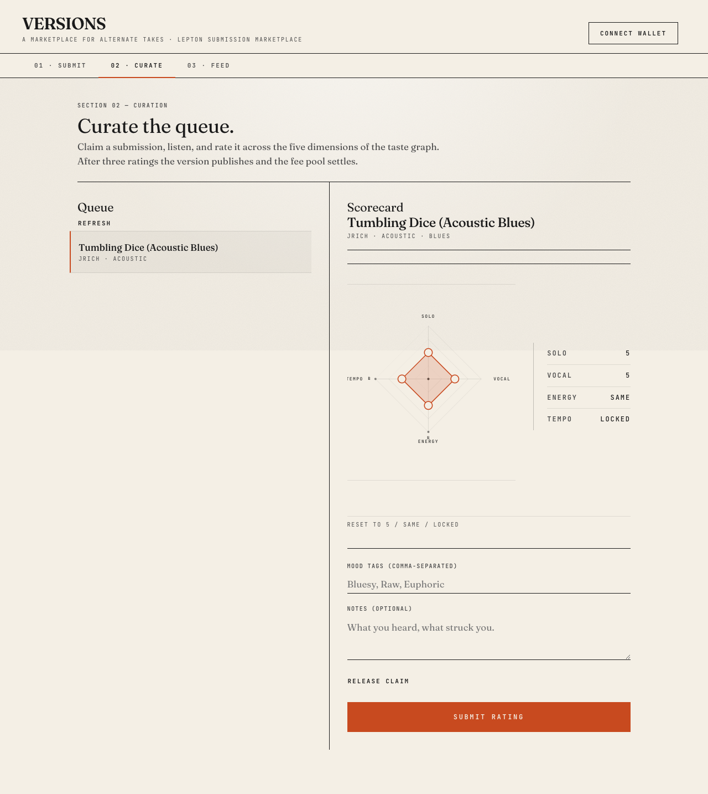
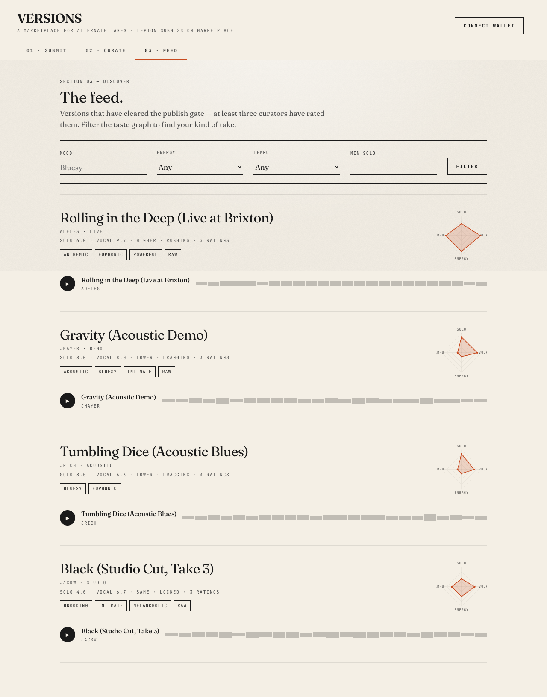

# VERSIONS — Demo Walkthrough

A 90-second walkthrough of the Lepton Submission Marketplace, in
three frames. Open the live demo alongside this document, or read
through on its own — the screenshots tell the same story.

> Live demo: see the [README](../README.md#quick-start) for the
> one-command run. The seeded catalog (`npm run seed`) populates
> the feed with 4 published versions so the discovery tab is
> alive on first load.

---

## Frame 1 — Submit a version (artists)

An artist pays 0.50 USDC to put a take in the queue.



The form is a single document. No cards, no progressive disclosure,
no tooltips: title, artist, version type, genre, mood, description,
audio file. Field labels are mono small caps; inputs are
borderless underlines. The "Submit for 0.50 USDC" button is a
full-width rust slab — the single signal color in the system.

The artist signs the submission with Phantom (Solana) and pays the
fee. In mock-first mode (the default), no real keys are needed —
the proxy synthesises a deterministic tx hash and flips the
submission to `awaiting_curation`. In real Arc testnet mode, the
client uses MetaMask to send a real USDC `transfer(address,uint256)`
to the platform wallet, then polls `verify-payment` for finality.

## Frame 2 — Curate the queue (curators)

A curator claims a submission and rates it across the four
quantitative dimensions of the taste graph.



The interactive radar replaces the 5 generic sliders. Four
draggable handles at the cardinal directions — SOLO (top), VOCAL
(right), ENERGY (bottom), TEMPO (left). The user drags a handle
along its axis; the polygon closes. The discrete tags (L / S / H
on energy, D / L / R on tempo) show where the snap boundaries
fall so the curator knows what semantic string their drag will
produce.

Below the radar, a mono readout shows the current values live
(SOLO 5 · VOCAL 5 · ENERGY SAME · TEMPO LOCKED). Mood tags and
notes are free text below the radar.

When the third curator rates a submission, the publish transaction
fires inside a single SQL transaction: aggregate the taste graph,
insert `published_versions`, flip the submission to `published`,
insert the 5 settlement legs. The actual Arc `sendTransfer` calls
happen after the transaction commits, then flip each leg to
`settled` with a `tx_hash`. Network calls never sit inside a
write lock.

## Frame 3 — Discover the feed (everyone)

The feed is the catalog of published versions, filterable by the
taste graph.



Each entry is an editorial row: large serif title, mono metadata
line, the taste-graph radar on the right, mood tags, the custom
audio widget (a circle play button, title + by-line, a
24-bar animating faux-waveform). A single hairline rule between
entries. No cards, no shadows.

The filter bar at the top — mood (LIKE on the JSON array), energy
and tempo (exact match), min solo, artist wallet — runs prepared
statements with bound parameters. Pagination is a hard 100-row
cap, offset is query-param-driven.

---

## What the radar looks like in motion

A 1-minute Playwright trace of the full submit → curate → publish
→ feed flow, with the radar dragging in real time. (Planned;
the screenshot above is the still frame.)

## How a judge should run this

```bash
git clone https://github.com/thisyearnofear/versions
cd versions
npm install
node proxy-server.js &           # boots on :8080 with mock Arc
cd web && python3 -m http.server 3000 &  # serves the SPA
npm run seed                     # populates the feed
# Open http://localhost:3000
```

The full E2E flow takes about 60 seconds. The submission
marketplace's distinctive mechanic is the **taste graph** — every
other piece (queue, publish gate, settlement) is the
infrastructure that makes the radar's data valuable.

## Submission status

| Step                | Done |
|---------------------|------|
| Submit form         | ✅    |
| Curator + radar     | ✅    |
| Settlement legs     | ✅    |
| Feed + filter       | ✅    |
| Real Arc testnet    | ✅ (chainId 0x4cef52, RPC live) |
| Real EVM payment    | ✅ (MetaMask, mock-first fallback) |
| Production deploy   | 🔧 (Dockerfile + guide in DEPLOYMENT.md) |
| Demo video          | 🔜 (this document is the script) |
